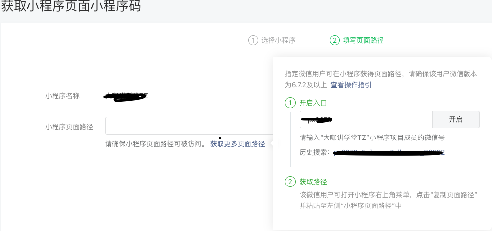
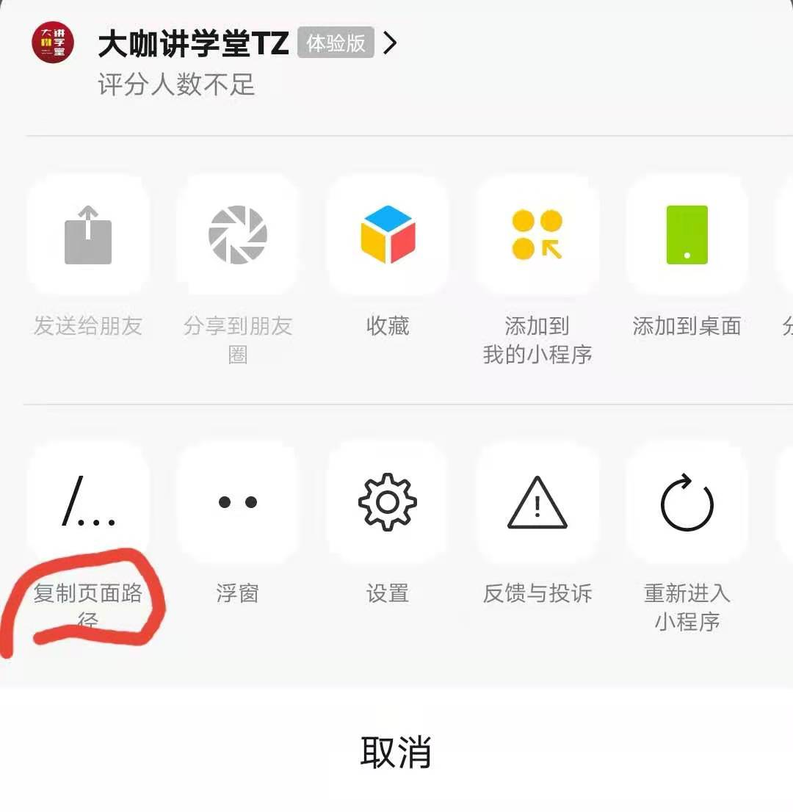

# 落地页跳转小程序

微信小程序的唤醒分为两种，一种是外部唤醒，一种是微信内唤醒。他们的机制不同。

 

## 技术实现

### 微信内部唤醒（微信公众号）

微信内部唤醒，需要使用微信的JSSDK去申请开放标签。[<wx-open-launch-weapp />](https://developers.weixin.qq.com/doc/offiaccount/OA_Web_Apps/Wechat_Open_Tag.html#21)，

需要在微信公众号内设置 js 安全域名为申请开放标签的网站

该标签需要2个参数，分别是要跳转的小程序原始ID和路径（路径包含query参数）

```tsx
<wx-open-launch-weapp id="launch-btn" username="gh_377a285c7xxxx" path="pages/index/index"> <!-- replace -->
  <script type="text/wxtag-template" v-html="htmlText"></script>
</wx-open-launch-weapp>
<!-- 在 vue 框架中，得使用 script type="text/wxtag-template"，在普通网页中，可以使用 template  -->
```

> 该标签官网文档说明必须用户点击才可以触发跳转小程序。

不过，微信内使用该标签需要先配置。如果你是按照官网推荐使用云开发静态网页托管的话，可以少做一步鉴权。

```tsx
wx.config({
  // debug: true, // 调试时可开启
  appId: '小程序APPID', // <!-- replace -->
  timestamp: 0, // 必填，填任意数字即可，最好也转成字符串
  nonceStr: 'nonceStr', // 必填，填任意非空字符串即可
  signature: 'signature', // 必填，填任意非空字符串即可
  jsApiList: ['previewImage'], // 必填，随意一个接口即可，不能传空数组
  openTagList:['wx-open-launch-weapp'], // 填入打开小程序的开放标签名
})
// 如果使用静态网页托管，那么上方的 timestamp，nonceStr，signature 和 jsApiList 可以随意填写。
```

之后，你就可以看到网页加载完毕后，冒出一个绿色按钮，点击既可跳转对应小程序

如果你不想使用云开发，那么需要后端提供相应的鉴权接口

1. 先使用 appId 和 secret [生成临时授权的 accessToken](https://developers.weixin.qq.com/doc/offiaccount/Basic_Information/Get_access_token.html)
2. 再根据获取的 token [生成签名](https://developers.weixin.qq.com/doc/offiaccount/OA_Web_Apps/JS-SDK.html#62)返回给前端使用。

最后你就可以像上文一样，去获取原生标签，然后跳转小程序。

### 微信外部唤醒（微信小程序）

从2020年底，微信开始支持外部短信和网站[唤醒小程序](https://developers.weixin.qq.com/miniprogram/dev/framework/open-ability/url-scheme.html)了

在你进入微信公众号的小程序管理后台，会发现右上角有个生成小程序二维码和 SchemeUrl 的选项。其中的小程序 Scheme 就是外部唤醒小程序的关键。

如果你自己有小程序，可以使用公众号来生成 Scheme，如果你是提供服务的话，可以使用 appId 和 secret 来[生成对应的小程序 Scheme](https://developers.weixin.qq.com/miniprogram/dev/api-backend/open-api/url-scheme/urlscheme.generate.html)。

1. 在 iOS 设备上可以直接从短信和浏览器中打开跳转，首次跳转可能会询问是否打开微信。其原理可能是使用 iOS 的通用链接来实现。
2. 在 Android 设备上则不可以直接输入打开，要先打开网页，该网页使用 location.href = Scheme 来跳转，有时为了兼容更多场景还需要一并使用 a 标签和 iframe 来跳转。

## 公众号配置

### 微信内部唤醒

1. 配置获取JSSDK权限：【设置】-【公众号设置】-【功能设置】-【JS接口安全域名】
2. 获取跳转小程序的原始ID：【设置】-【公众号设置】-【账号详情】
3. 获取跳转小程序的路径：见【复制小程序路径】

### 复制小程序路径：

1. 进入小程序公众号平台，选择右上角的【工具】- 【生成小程序码】
2. 输入你的小程序名称，选中后点击下一步。
3. 在第二项小程序页面路径的提示栏有一个【获取更多页面路径】
4. 悬浮上方，添加小程序项目成员的微信号，点击开启






### 微信外部唤醒

1. 获取小程序appID：【开发】-【开发管理】-【开发设置】-开发者ID
2. 获取小程序秘钥：【开发】-【开发管理】-【开发设置】-开发者ID
3. 获取跳转小程序的路径：见上方【复制小程序路径】

### 官方[常见错误及解决办法](https://developers.weixin.qq.com/doc/offiaccount/OA_Web_Apps/JS-SDK.html#%E9%99%84%E5%BD%955-%E5%B8%B8%E8%A7%81%E9%94%99%E8%AF%AF%E5%8F%8A%E8%A7%A3%E5%86%B3%E6%96%B9%E6%B3%95)